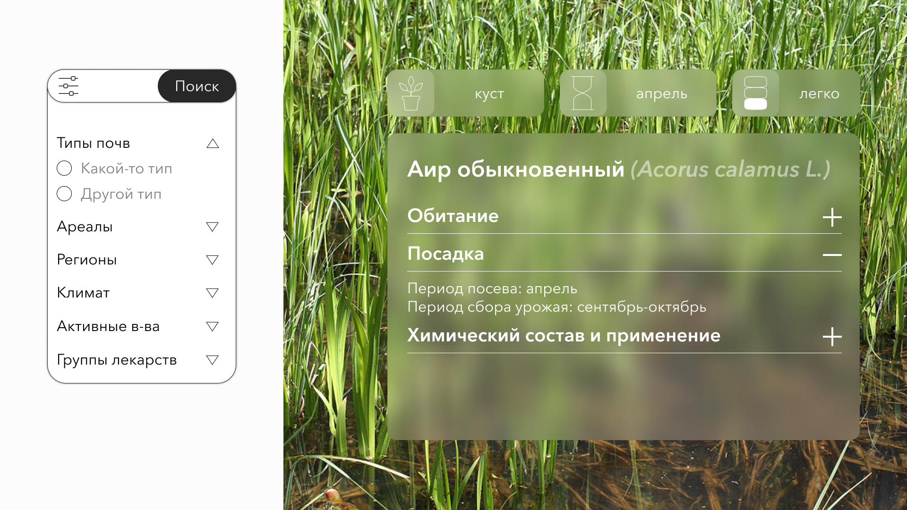

## Botanica

> Intellectual medical herbs database

### Architecture

Currently frontend, plants microservice, pdf-extractor


### How to start your own DB

You must provide mongoDB connection uri as env variable before running compose

```shell
export MONGO=mongodb:user:password@host:port
docker-compose up --build -d
```

### How to start with our DB

To start services on machine simply run

```shell
docker-compose up --build -d
```

### How to get copy of our DB

- After hack [email me](mailto:artamonov.dnl@gmail.com?subject=Botanica "Contact email") or

  ```shell
  sudo mongodump -h 82.148.30.25:27017 --forceTableScan -d botanica -u botanica -p botanica2023botanica --authenticationDatabase admin --out /opt/backup/mongodump-2023-05-21
  ```

  to get dump of database

### For content visit

- localhost:8000/
- localhost:8000/glossary

API:

- localhost:9000/api/v1/plants
GET returns all plants JSON's

### Design





### Team

shotdawn

1. Danila Artamonov (Backend/ML, MISIS)
2. Tani Suksina (Backend, MISIS)
3. Vsevolod (Frontend)
4. Yana (UX/UI)
